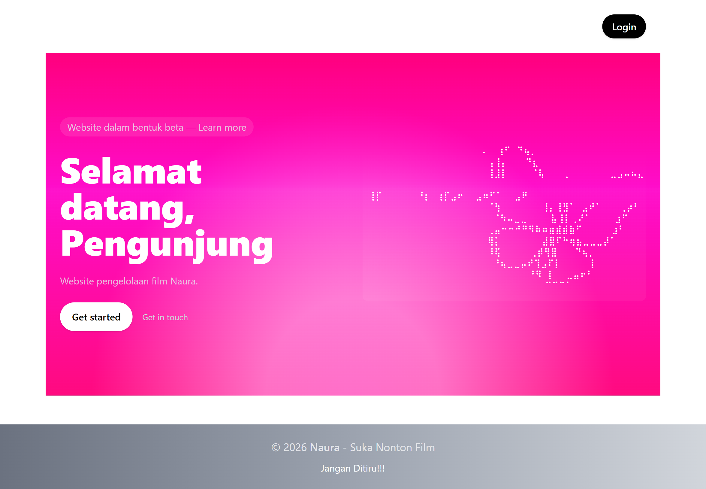
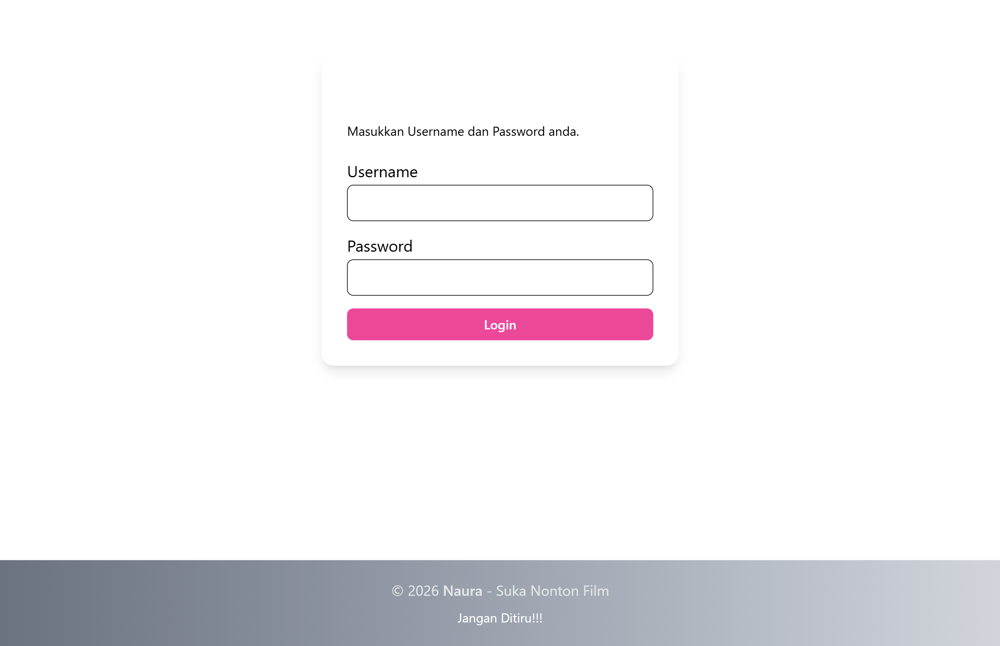
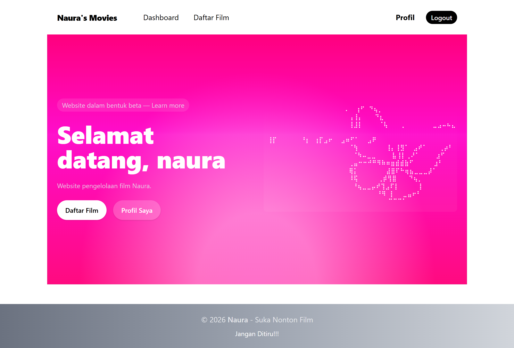
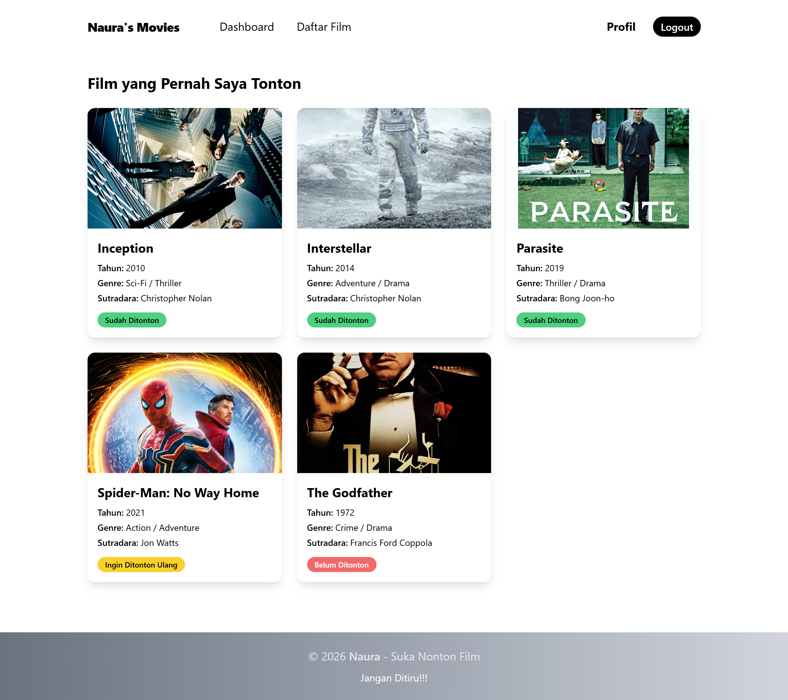
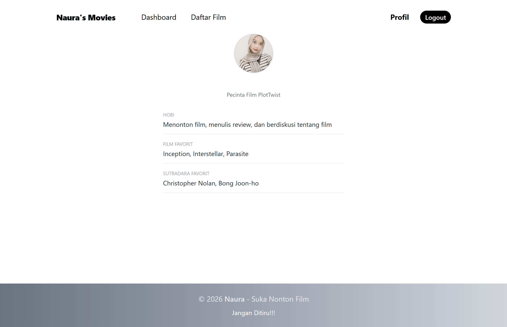

# Naura's Movies

Website pengelolaan koleksi film pribadi yang dibangun menggunakan **Laravel** dan **Tailwind CSS**.

---

## Tentang Project

**Naura's Movies** adalah sebuah website pengelolaan daftar film pribadi. Website ini memungkinkan pengguna untuk melihat koleksi film beserta informasi lengkapnya seperti judul, tahun rilis, genre, sutradara, dan status tonton. Terdapat juga sistem login sederhana untuk membatasi akses ke halaman tertentu.

---

## Teknologi yang Digunakan

- **PHP** - Bahasa pemrograman utama
- **Laravel** - Framework PHP untuk membangun aplikasi web
- **Blade** - Template engine bawaan Laravel untuk membuat tampilan (View)
- **Tailwind CSS** - Framework CSS berbasis utility untuk styling tampilan, dimuat via CDN
- **Session** - Untuk menyimpan status login pengguna

---

## Fitur Website

- Halaman **Dashboard** — halaman utama dengan sapaan dinamis berdasarkan status login
- Halaman **Login** — autentikasi pengguna dengan username dan password
- Halaman **Daftar Film** — menampilkan koleksi film dalam bentuk card grid dengan badge status berwarna
- Halaman **Profil** — menampilkan informasi profil pengguna yang sedang login
- **Proteksi halaman** — halaman daftar film dan profil hanya bisa diakses setelah login
- **Responsive design** — tampilan menyesuaikan ukuran layar (HP, tablet, desktop)

---

## Cara Menjalankan Project

1. Clone atau download project ini
2. Masuk ke folder project
3. Install dependencies:
   ```bash
   composer install
   ```
4. Copy file environment:
   ```bash
   cp .env.example .env
   php artisan key:generate
   ```
5. Jalankan server:
   ```bash
   php artisan serve
   ```
6. Buka browser dan akses `http://127.0.0.1:8000`

---

## Akun Login

| Username | Password |
|----------|----------|
| naura | naura123 |

---

## Screenshot

> **Dashboard (Belum Login)**
> 
> Halaman utama yang menyambut pengunjung dengan tampilan hero gradient pink. Terdapat tombol "Get started" untuk mengarahkan ke halaman login.



---

> **Halaman Login**
>
> Form login sederhana dengan input username dan password. Terdapat validasi dan pesan error jika username atau password salah.



---

> **Dashboard (Sudah Login)**
>
> Setelah login, sapaan berubah menjadi nama pengguna dan muncul tombol "Daftar Film" serta "Profil Saya". Navbar juga muncul di bagian atas.



---

> **Halaman Daftar Film**
>
> Menampilkan koleksi film dalam bentuk card grid. Setiap card berisi poster, judul, tahun, genre, sutradara, dan badge status dengan warna berbeda — hijau untuk "Sudah Ditonton", merah untuk "Belum Ditonton", dan kuning untuk "Ingin Ditonton Ulang".



---

> **Halaman Profil**
>
> Menampilkan informasi profil pengguna yang sedang login, termasuk foto profil (atau inisial jika foto tidak tersedia), hobi, film favorit, dan sutradara favorit.



---

## Developer

**Naura Indra Agustin - 242410101070**